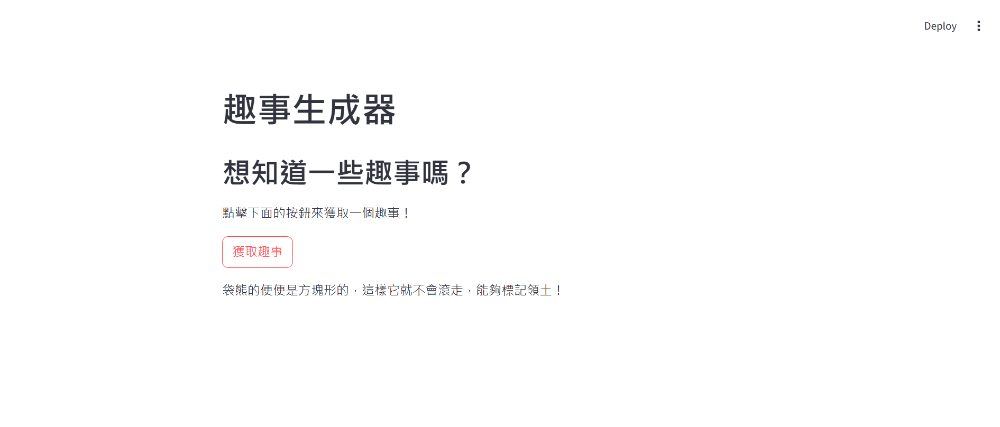

# Fun Facts App

使用 Streamlit 建立一個介面，點擊按鈕即可隨機取得一則趣味小知識。

## Overview

- 語言：Python v3.9.15  
- 模組：streamlit v1.42.2  

## Run

```bash
streamlit run fun_facts_app.py
```

伺服器運行於 `http://localhost:8501`

## UI


